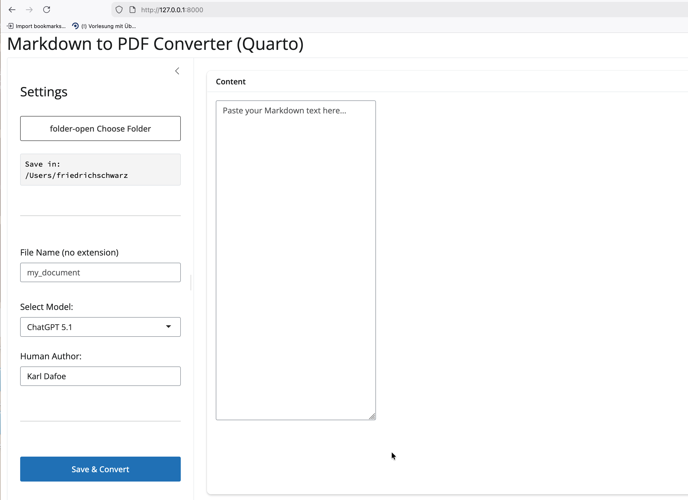

# **llmmd2pdf Documentation**

**llmmd2pdf** is a local utility that streamlines the process of archiving conversations from Large Language Models (LLMs) like ChatGPT, Gemini, and Claude. It cleans raw markdown exports, adds metadata, and converts them to professional-looking PDFs using [Quarto](https://quarto.org/).

## **Interface Overview**

The application interface is divided into two main sections: the **Settings Sidebar** (left) and the **Content Editor** (right).

### **1\. Settings Sidebar**

This is where you configure the output details for your document.

* **Choose Folder**: Click the folder icon to open a native system dialog. This sets the destination directory where both the .md source and the generated .pdf will be saved.  
* **File Name**: Enter the desired filename (e.g., quantum\_computing\_summary). *Do not include the file extension; the app adds .md and .pdf automatically.*  
* **Select Model**: Choose the AI model used for the conversation (e.g., "GPT-4o", "Gemini 1.5 Pro").  
  * *Tip*: You can type a new model name here (e.g., "Llama 3") to add it to your configuration permanently.  
* **Human Author**: Enter your name. This will be combined with the model name in the PDF metadata (e.g., "GPT-4o & Karl Dafoe").  
* **Save & Convert**: The magic button. It triggers the saving, preprocessing, and PDF conversion workflow.

### **2\. Content Editor**

* **Markdown Content**: Paste the raw text directly from your LLM chat window into this large text area.  
* The app will automatically clean up common copy-paste artifacts (like "Regenerate response" buttons, profile picture placeholders, or Gemini location footers) before saving.

## **Workflow Guide**

1. **Launch the App**: Run llmmd2pdf in your terminal.  
2. **Paste Text**: Copy the entire conversation from your browser and paste it into the **Content** area.  
3. **Set Destination**: Select where you want the PDF to go.  
4. **Metadata**: Ensure the Model and Author are correct.  
5. **Generate**: Click **Save & Convert**.  
   * *Success*: A green message appears confirming the file creation.  
   * *Clean Slate*: The content area clears automatically so you are ready for the next chat.

## **Configuration**

Your preferences (Author name, Port, Custom Models) are saved automatically in a configuration file found here:

| OS | Configuration Path |
| :---- | :---- |
| **macOS** | \~/Library/Application Support/llmmd2pdf/config.toml |
| **Windows** | %APPDATA%/llmmd2pdf/config.toml |
| **Linux** | \~/.config/llmmd2pdf/config.toml |

You can edit this file manually to change the default port or clean up the model list.

## **Development Notes**

Please refer to the [Development Reminders](./development.md) for guidelines on building new releases, local module testing, and other development tasks.
